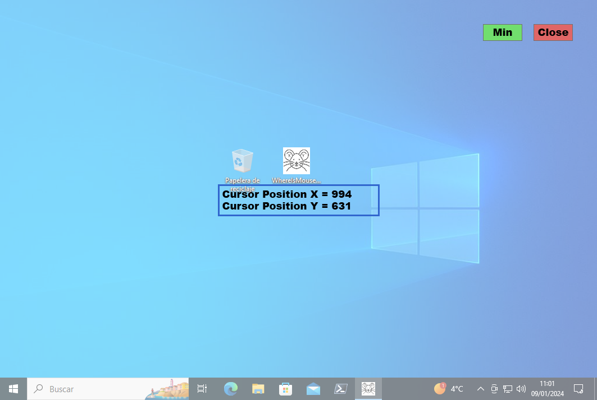

# WhereIsMouse

## Localiza la posición del cursor

Esta pequeña aplicación desarrollada en C# te permite visualizar la posición del ratón en el escritorio, En un proyecto para desarrollar una aplicación de escritorio me surgió la necesidad de localizar   diferentes puntos en la pantalla del escritorio, y de esa necesidad surgió esta aplicación, que puede parecer que realiza una tarea bastante irrelevante, pero si como yo, necesitas saber que coordenadas tiene un punto específico de tu escritorio, esta es tu aplicación, ligera, sencilla, y que hace su trabajo.  
Al ejecutarla crea una capa translúcida en tu escritorio por el que puedes mover el ratón al punto  deseado, en el centro de la pantalla te aparecerán las coordenadas (X,Y) del punto donde está situado tu ratón. En la parte superior izquierda tienes dos botones que te permitirán minimizar la aplicación y cerrarla.  

## locate the position of the cursor

This small application developed in C# allows you to view the position of the mouse on the desktop, In a project to develop a desktop application I had the need to locate different points on the desktop   screen, and this application arose from that need, which may seem like it performs a fairly irrelevant task, but if like me, you need to know what coordinates does a specific point on your desktop have, this  is your application, light, simple, and it does its job.  
When you run it, it creates a translucent layer on your desktop through which you can move the mouse to the desired point, in the center of the screen the coordinates (X,Y) of the point where it is will ppear. located your mouse. At the top left you have two buttons that will allow you to minimize the application and  close it.  

